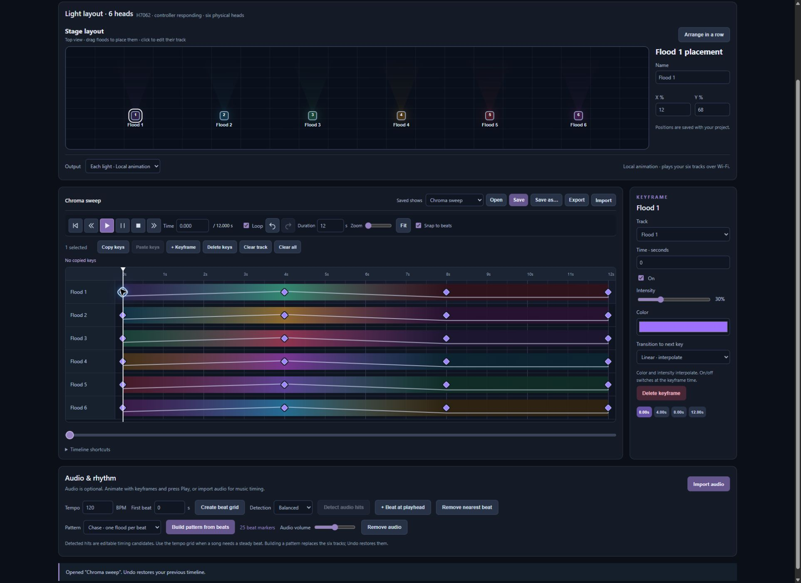
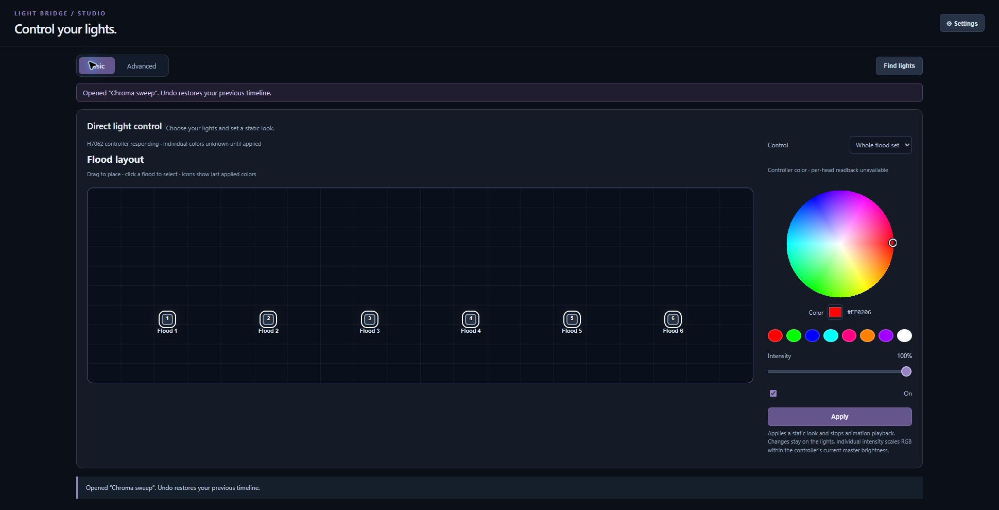

<div align="center">

# Light Bridge Studio
### Your yard. Your timeline. Your light show.

A local lighting editor for six-head **Govee H7062 floods** — with a visual stage, keyframe animation, and built-in MCP tools for agent-authored shows.

**Python · Vanilla JavaScript · Local LAN playback · MIT**

[Get started](#get-started) · [The editor](#make-light-move) · [MCP for agents](#built-in-mcp-for-lighting-agents) · [Security](SECURITY.md)

</div>



## Make light move

Arrange your floods like they sit in the real world. Build a slow crossfade, a moving chase, or a Halloween lightning sequence. Each light gets its own track, with color, intensity, power, and transition controls.

| Design | Perform | Keep |
| --- | --- | --- |
| Six independent keyframe tracks | Local Wi-Fi playback at up to 10 Hz | Named shows saved to disk |
| Linear fades or held/jump changes | Loop, seek, pause, and stop | JSON import and export |
| Box-select, group-drag, copy between lights | Optional audio and editable beat markers | Undo and redo |
| Color and intensity previews | Layout-aware pattern generation | Built-in MCP authoring tools |

Music is optional. Explore the included Chroma sweep, or clear its tracks and animate directly.

## Just set a look

The Basic page puts the stage layout next to a color wheel, eight color chips, and an intensity slider. Select a flood or the whole set and press **Apply**.



## Get started

Tested on **Windows with Python 3.12**. No Python packages, build step, Node runtime, Govee cloud account, or Home Assistant installation are required for local timeline playback. Cloud controls require a Govee API key; encrypted credential storage uses Windows DPAPI.

Install [Git for Windows](https://git-scm.com/download/win) if you do not already have Git. Alternatively, download and extract the repository ZIP, then open a terminal in that folder and run `python launch.py`.

```powershell
git clone https://github.com/throb/govee-controller.git
cd govee-controller
python launch.py
```

1. Enable **LAN Control** for the floods in Govee Home and connect the computer to the same LAN.
2. Open **http://127.0.0.1:8765/**. First launch asks for your Govee API key: use **Save & connect**, or explicitly continue without a key for local LAN control. Click **Find lights** to discover your controller. A single discovered H7062 is selected automatically.
3. Open **Advanced** and create keyframes. **Local animation** is the default output.
4. Press **Play** to animate the physical floods. Enable **Loop** to repeat. If no controller responds, the app reports the connection failure instead of silently playing only on screen.
5. Use **Save as…** to create a named show. **Save** updates it; **Export** makes a portable JSON copy.

### Save your first show

The included Chroma sweep gives you six editable tracks. Edit a diamond's color, intensity, time, or transition, then use **Save as…** to name your show. Use the Saved shows selector and **Open** to load it again. You can design and save without hardware; playback requires a responding controller.

### Basic individual-head control

Whole-set Basic control uses LAN. Selecting one individual head currently uses the cloud API and requires an initial head test:

1. Enter your Govee API key in **Settings** and connect. The key stays encrypted across restarts.
2. In **Settings → Connection diagnostics**, click **Test separate heads**. This changes the physical lights temporarily.
3. Confirm the result only if you see six distinct colors, then return to **Basic** and select a flood.

This cloud calibration is not required for local timeline playback. If the test cannot connect, check that the H7062 belongs to the same Govee account as the API key.

### Network configuration

Discovery tries multicast on the available IPv4 interfaces. If multicast returns no supported flood controller, it also sends Govee discovery requests to addresses already present in the local OS neighbor table. It does not sweep the subnet or treat a cached address as a connected device: the controller must reply. On networks that block discovery, an explicit target remains available below.


For multiple network adapters, multicast discovery problems, or more than one H7062, create `data/network.json` (excluded from Git):

```json
{
  "lan_ip": "YOUR_COMPUTER_LAN_IP",
  "flood_id": "YOUR_H7062_DEVICE_ID",
  "targets": ["YOUR_FLOOD_LAN_IP"]
}
```

Replace the placeholders with your installation values. Omit fields you do not need. `lan_ip` defaults to all local interfaces, `targets` adds unicast discovery destinations, and `flood_id` pins one controller. With multiple discovered H7062 controllers, playback requires an explicit ID. Environment variables `LIGHT_BRIDGE_LAN_IP` and `LIGHT_BRIDGE_FLOOD_ID` override the corresponding fields. Restart after configuration changes. Allow local UDP traffic on ports 4001–4003 if your firewall blocks discovery.

### Troubleshooting first launch

| Symptom | Check |
| --- | --- |
| `python` is not found or opens the Store | Install [Python 3.12](https://www.python.org/downloads/windows/); on Windows, try `py -3.12 launch.py`. |
| No floods found | Confirm the H7062 is powered, LAN Control is enabled, and both devices share a reachable LAN. Set `lan_ip` and `targets` for the correct adapter if multicast is blocked. |
| More than one H7062 found | Pin the desired controller with `flood_id` in local configuration. |
| Basic single-head Apply asks for a test | Complete the cloud connection and visual separate-head test described above. |
| Address already in use | Close another controller using UDP 4002. Launch only one Light Bridge server; `launch.py` reuses the server only when it belongs to the same installation. A different installation must be stopped in its terminal before launching this one. |
| Agent cannot connect | Start the app first, use absolute MCP executable/script paths, then reconnect the MCP client. |

### Editing shortcuts

| Action | Control |
| --- | --- |
| Select several keys | Shift/Ctrl-click, or drag a selection box |
| Add to selection | Shift-drag |
| Move selected keys | Drag a selected diamond |
| Copy / paste keys | Ctrl+C / Ctrl+V, or toolbar buttons |
| Undo / redo | Ctrl+Z / Ctrl+Shift+Z or Ctrl+Y |
| Play / pause | Space outside text inputs |
| Add a key | Double-click the timeline |

## What runs where

The computer evaluates the timeline and streams six-color effect frames over LAN. **Keep the computer and server running.** Saving a show does not install it into the device's preset library. Arbitrary timeline upload as a standalone device effect is not implemented.

This is an experimental H7062 controller, not a universal Govee driver. Local looping and individual-head animation have been physically verified on one installation. Cloud per-head commands are slower and unsuitable for tight animation timing. UDP sends alone do not prove that a light changed.

The device does not report per-head colors; Basic icons show the last applied values. Stop restores the controller's starting shared power, brightness, and color, not an earlier per-head pattern or native effect. Home Assistant integration is not bundled. See [custom effect experiments](CUSTOM_EFFECTS.md) for the separate palette-upload path.

## Private by default

The web server listens only on loopback. Browser tabs and MCP mutations are bound to the running server instance, preventing a stale tab from overwriting a restarted or different installation. API credentials are encrypted for the current Windows user, never returned by the credential status endpoint, and never included in MCP configuration. Local shows, imported audio, network configuration, calibration, and credentials live under ignored `data/`. The static server only serves an explicit asset allowlist.

Do not expose this unauthenticated local app through a public tunnel or reverse proxy. See [security scope and checks](SECURITY.md).

## Built-in MCP for lighting agents

The MCP server ships in this repository as [`mcp_server.py`](mcp_server.py). It uses Python's standard library, requires no separate MCP package, and connects to the running Light Bridge app on `127.0.0.1:8765`.

1. Start the app with `python launch.py`.
2. Register the bundled server in your MCP client, using absolute paths to your Python executable and this checkout.
3. Reconnect your client, then read the MCP resource `lightbridge://guide`.

For Codex:

```powershell
codex mcp add light-bridge -- "C:/path/to/python.exe" "C:/path/to/govee-controller/mcp_server.py"
```

For clients supporting an `mcpServers` JSON configuration:

```json
{
  "mcpServers": {
    "light-bridge": {
      "command": "C:/path/to/python.exe",
      "args": ["C:/path/to/govee-controller/mcp_server.py"]
    }
  }
}
```

### Agent tools

| Tools | Purpose |
| --- | --- |
| `lighting_capabilities`, `lighting_discover`, `lighting_status` | Inspect supported features, discover controllers, and check playback |
| `show_create`, `show_set_track`, `show_validate` | Author and inspect six-track shows with RGB, intensity, on/off, and linear/jump transitions |
| `shows_list`, `show_get`, `show_save` | Manage named shows stored on disk |
| `show_play`, `lighting_loop`, `lighting_stop` | Explicitly control physical playback |

Creating, editing, validating, or saving a show does not start playback. `show_play` streams the saved timeline through the computer; it does **not** install a standalone preset on the floods. The MCP server exposes no credential-reading tools. Enter any required Govee API key through the app's Settings, not the MCP configuration.

See the [complete agent guide](MCP_GUIDE.md) for schemas, timing semantics, examples, and limitations. A [six-track blue/amber example](examples/blue_amber_show.json) is included. The [MCP tests](tests/test_mcp.py) run with the normal Python test suite. The opt-in [live protocol check](tests/verify_mcp_live.py) requires the app, scans devices, and saves an example show; it does not start physical playback.


## Development

```powershell
python -m unittest discover -s tests -p "test_*.py"
node --test tests/timeline.test.js
node --check app.js
```

Node is only used for JavaScript checks. The app itself uses Python's standard library and browser-native JavaScript. Live MCP verification is opt-in and described in [MCP_GUIDE.md](MCP_GUIDE.md).

## License & acknowledgments

[MIT](LICENSE). Independent project; not affiliated with Govee. Packet-framing references and attribution are in [THIRD_PARTY_NOTICES.txt](THIRD_PARTY_NOTICES.txt).
